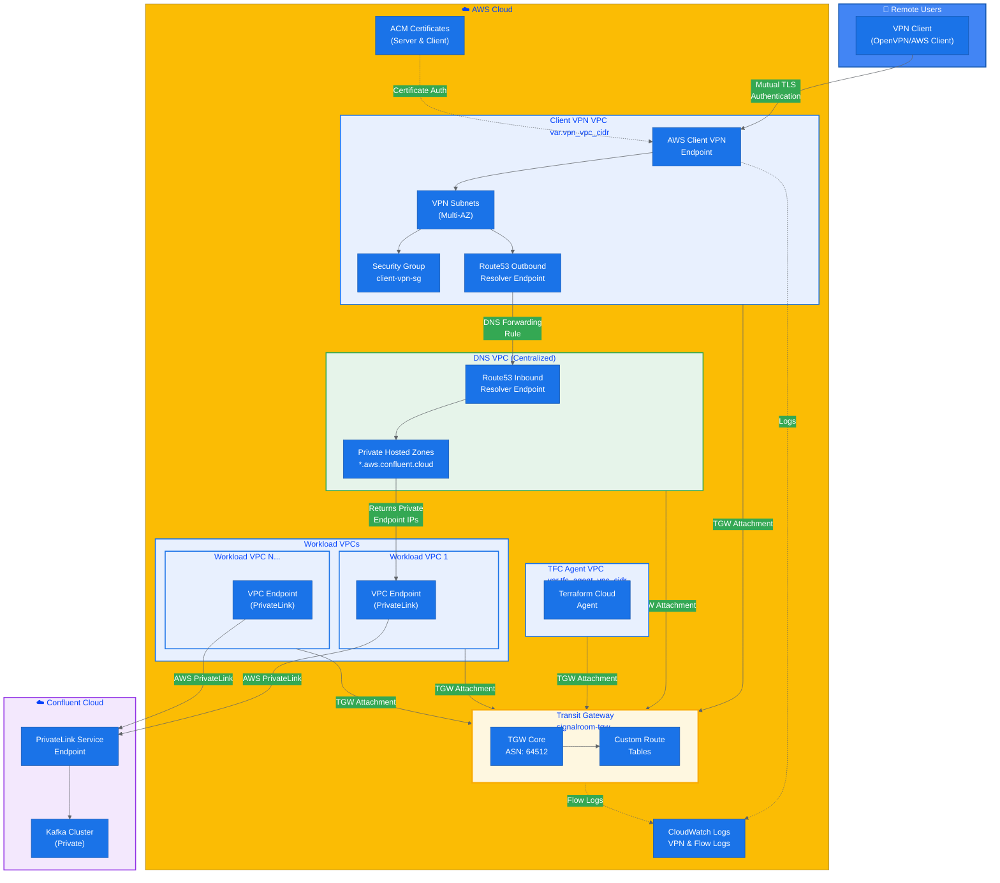

# IaC Confluent Cloud AWS Private Linking, Infrastructure and Networking Example
 Officially, [Febrary 13, 2026, Confluent Cloud](https://docs.confluent.io/cloud/current/release-notes/index.html#february-13-2026) announced support for Ingress Gateway and Ingress Gateway Access Points as the support resources for private connections between AWS and Confluent Cloud.  **_These replace PrivateLink Attachment (PLATT) resources and PLATT connections going forward._**

 > **Note:** Support for PLATT will end in a future release.

This repo provides a comprehensive Terraform configuration example for building a fully private connectivity architecture between AWS and Confluent Cloud using AWS PrivateLink. It demonstrates how to leverage a centralized DNS architecture with Route 53 Private Hosted Zones and Transit Gateway to enable scalable, multi-VPC access to Confluent Cloud Kafka clusters over PrivateLink, without exposing any traffic to the public internet.

Below is the Terraform resource visualization of the infrastructure:


---

**Table of Contents**
<!-- toc -->
+ [**1.0 Prerequisites**](#10-prerequisites)
    + [**1.1 Client VPN, Centralized DNS Server, and Transit Gateway**](#11-client-vpn-centralized-dns-server-and-transit-gateway)
        + [**1.1.1 Key Features Required for Confluent PrivateLink to Work**](#111-key-features-required-for-confluent-privatelink-to-work)
            - [**1.1.1.1 Hub-and-Spoke Network Architecture via Transit Gateway**](#1111-hub-and-spoke-network-architecture-via-transit-gateway)
            - [**1.1.1.2 Centralized DNS Resolution (Critical for PrivateLink)**](#1112-centralized-dns-resolution-critical-for-privatelink)
            - [**1.1.1.3 DNS Forwarding Chain**](#1113-dns-forwarding-chain-as-documented-in-your-outputs)
            - [**1.1.1.4 VPC Endpoints (AWS PrivateLink)**](#1114-vpc-endpoints-aws-privatelink)
            - [**1.1.1.5 Client VPN Integration**](#1115-client-vpn-integration)
            - [**1.1.1.6 Cross-VPC Routing**](#1116-cross-vpc-routing)
            - [**1.1.1.7 Security & Observability**](#1117-security--observability)
    + [**1.2 Terraform Cloud Agent**](#12-terraform-cloud-agent)
        + [**1.2.1 Key Features of the TFC Agent Setup**](#121-key-features-of-the-tfc-agent-setup)
            - [**1.2.1.1 Custom DHCP Options for DNS Resolution**](#1211-custom-dhcp-options-for-dns-resolution)
            - [**1.2.1.2 Transit Gateway Connectivity**](#1212-transit-gateway-connectivity)
            - [**1.2.1.3 Security Group Configuration for Kafka/PrivateLink Traffic**](#1213-security-group-configuration-for-kafkaprivatelink-traffic)
            - [**1.2.1.4 AWS VPC Endpoints for Private Service Access**](#1214-aws-vpc-endpoints-for-private-service-access)
            - [**1.2.1.5 ECS Fargate Deployment Pattern**](#1215-ecs-fargate-deployment-pattern)
            - [**1.2.1.6 IAM Permissions for Infrastructure Management**](#1216-iam-permissions-for-infrastructure-management)
            - [**1.2.1.7 Network Architecture Summary**](#1217-network-architecture-summary)
+ [**2.0 Project's Architecture Overview**](#20-projects-architecture-overview)
    + [**2.1 Why This Architecture?**](#21-why-this-architecture)
        + [**2.1.1 The Problem: PrivateLink Is VPC-Scoped, But Your Organization Isn't**](#211-the-problem-privatelink-is-vpc-scoped-but-your-organization-isnt)
        + [**2.1.2 The Solution: Centralized DNS with a Single PHZ and Smart CNAMEs**](#212-the-solution-centralized-dns-with-a-single-phz-and-smart-cnames)
        + [**2.1.3 The Critical Piece Most Architectures Miss: The SYSTEM Resolver Rule**](#213-the-critical-piece-most-architectures-miss-the-system-resolver-rule)
        + [**2.1.4 Why Not VPC Peering?**](#214-why-not-vpc-peering)
        + [**2.1.5 Why Separate VPCs Per Cluster Instead of One Big VPC?**](#215-why-separate-vpcs-per-cluster-instead-of-one-big-vpc)
        + [**2.1.6 The Terraform Cloud Agent Piece**](#216-the-terraform-cloud-agent-piece)
+ [**3.0 Let's Get Started**](#30-lets-get-started)
    - [**3.1 Deploy the Infrastructure**](#31-deploy-the-infrastructure)
    - [**3.2 Teardown the Infrastructure**](#32-teardown-the-infrastructure)
+ [**4.0 References**](#40-references)
    - [**4.1 Terminology**](#41-terminology)
    - [**4.2 Related Documentation**](#42-related-documentation)
<!-- tocstop -->

---

## **1.0 Prerequisites**
This project assumes you have the following prerequisites in place:
- Client VPN, Centralized DNS Server, and Transit Gateway
- Terraform Cloud Agent

### **1.1 Client VPN, Centralized DNS Server, and Transit Gateway**


#### **1.1.1 Key Features Required for Confluent PrivateLink to Work**

##### **1.1.1.1 Hub-and-Spoke Network Architecture via Transit Gateway**
- Transit Gateway serves as the central routing hub connecting all VPCs
- Disabled default route table association/propagation for explicit routing control
- DNS support enabled on the TGW (`dns_support = "enable"`)
- Custom route tables for fine-grained traffic control between VPCs

##### **1.1.1.2 Centralized DNS Resolution (Critical for PrivateLink)**
- **Dedicated DNS VPC** with Route53 Inbound Resolver endpoints
- **Private Hosted Zones** for `*.aws.confluent.cloud` domain
- DNS forwarding rules route Confluent queries from all VPCs to the central DNS VPC
- Route53 Outbound Resolver in VPN VPC forwards to DNS VPC resolver IPs

##### **1.1.1.3 DNS Forwarding Chain** (as documented in your outputs)
1. Client queries `lkc-xxxxx.us-east-1.aws.private.confluent.cloud`
2. VPN VPC's default DNS forwards to Route53 Outbound Resolver
3. Outbound Resolver forwards to DNS VPC Inbound Resolver
4. DNS VPC checks Private Hosted Zones → returns VPC Endpoint private IPs

##### **1.1.1.4 VPC Endpoints (AWS PrivateLink)**
- VPC Endpoints in workload VPCs connecting to Confluent's PrivateLink service
- Security groups allowing traffic from authorized sources (VPN clients, TFC agents)

##### **1.1.1.5 Client VPN Integration**
- Mutual TLS authentication using ACM certificates (server + client)
- Split tunnel configuration for routing only Confluent traffic through VPN
- Authorization rules controlling which CIDRs VPN clients can access
- Routes added to VPN endpoint for all workload VPC CIDRs via Transit Gateway

##### **1.1.1.6 Cross-VPC Routing**
- TGW attachments for: VPN VPC, DNS VPC, TFC Agent VPC, and all Workload VPCs
- Route tables in each VPC with routes to other VPCs via TGW
- Workload VPC CIDRs aggregated and distributed to VPN client routes

##### **1.1.1.7 Security & Observability**
- Dedicated security groups per component (VPN endpoint, etc.)
- VPC Flow Logs and TGW Flow Logs to CloudWatch
- VPN connection logging for audit trails
- IAM roles with least-privilege for flow log delivery

### **1.2 Terraform Cloud Agent**

```mermaid
%%{init: {'theme': 'base', 'themeVariables': { 'primaryColor': '#1a73e8', 'primaryTextColor': '#fff', 'primaryBorderColor': '#1557b0', 'lineColor': '#5f6368', 'secondaryColor': '#34a853', 'tertiaryColor': '#fbbc04'}}}%%

flowchart TB
    subgraph TERRAFORM_CLOUD["☁️ Terraform Cloud (HCP)"]
        TFC["Terraform Cloud<br/>API & Workspaces"]
        AgentPool["Agent Pool<br/>(signalroom)"]
    end

    subgraph AWS["☁️ AWS Cloud"]
        subgraph TFC_AGENT_VPC["TFC Agent VPC<br/>var.vpc_cidr"]
            subgraph PUBLIC_SUBNETS["Public Subnets (Multi-AZ)"]
                IGW["Internet<br/>Gateway"]
                NAT1["NAT Gateway<br/>AZ-1"]
                NAT2["NAT Gateway<br/>AZ-2"]
            end
            
            subgraph PRIVATE_SUBNETS["Private Subnets (Multi-AZ)"]
                subgraph ECS["ECS Fargate Cluster"]
                    TFCAgent1["TFC Agent<br/>Container"]
                    TFCAgent2["TFC Agent<br/>Container"]
                end
                
                subgraph AWS_ENDPOINTS["AWS VPC Endpoints"]
                    VPCE_SM["Secrets Manager<br/>Endpoint"]
                    VPCE_CW["CloudWatch Logs<br/>Endpoint"]
                    VPCE_ECR["ECR API/DKR<br/>Endpoints"]
                    VPCE_S3["S3 Gateway<br/>Endpoint"]
                end
                
                CONFLUENT_SG["Confluent PrivateLink<br/>Security Group"]
            end
            
            DHCP["DHCP Options<br/>(Custom DNS)"]
            TFC_AGENT_SG["TFC Agent<br/>Security Group"]
        end

        subgraph TGW["Transit Gateway<br/>signalroom-tgw"]
            TGWCore["TGW Core"]
            TGWRT["Route Table"]
        end

        subgraph DNS_VPC["DNS VPC (Centralized)<br/>var.dns_vpc_cidr"]
            R53Inbound["Route53 Inbound<br/>Resolver"]
            PHZ["Private Hosted Zones<br/>*.aws.confluent.cloud"]
        end

        subgraph CLIENT_VPN_VPC["Client VPN VPC<br/>var.client_vpn_vpc_cidr"]
            VPNEndpoint["Client VPN<br/>Endpoint"]
        end

        subgraph WORKLOAD_VPCs["Workload VPCs<br/>(Confluent PrivateLink)"]
            subgraph WL1["Workload VPC 1"]
                VPCE1["PrivateLink<br/>Endpoint"]
            end
            subgraph WL2["Workload VPC N"]
                VPCEN["PrivateLink<br/>Endpoint"]
            end
        end

        SecretsManager["AWS Secrets Manager<br/>(TFC Agent Token)"]
        CloudWatch["CloudWatch Logs"]
        ECR_Registry["ECR Registry<br/>(hashicorp/tfc-agent)"]
    end

    subgraph CONFLUENT["☁️ Confluent Cloud"]
        PrivateLinkSvc["PrivateLink<br/>Service"]
        Kafka["Kafka Cluster<br/>(Private)"]
    end

    %% External Connections
    TFC <-->|"HTTPS/443<br/>via NAT"| TFCAgent1
    TFC <-->|"HTTPS/443<br/>via NAT"| TFCAgent2
    AgentPool -.->|"Agent Registration"| TFCAgent1

    %% Internal VPC Connections
    TFCAgent1 --> TFC_AGENT_SG
    TFCAgent2 --> TFC_AGENT_SG
    TFCAgent1 --> VPCE_SM
    TFCAgent2 --> VPCE_CW
    
    VPCE_SM -.->|"Private DNS"| SecretsManager
    VPCE_CW -.->|"Private DNS"| CloudWatch
    VPCE_ECR -.->|"Private DNS"| ECR_Registry

    NAT1 --> IGW
    NAT2 --> IGW
    TFCAgent1 -->|"0.0.0.0/0"| NAT1
    TFCAgent2 -->|"0.0.0.0/0"| NAT2

    %% DHCP & DNS Flow
    DHCP -->|"DNS Servers:<br/>VPC + Centralized"| TFCAgent1
    TFCAgent1 -->|"DNS Query:<br/>*.confluent.cloud"| R53Inbound

    %% Transit Gateway Connections
    TFC_AGENT_VPC -->|"TGW Attachment"| TGW
    DNS_VPC -->|"TGW Attachment"| TGW
    CLIENT_VPN_VPC -->|"TGW Attachment"| TGW
    WL1 -->|"TGW Attachment"| TGW
    WL2 -->|"TGW Attachment"| TGW

    %% Route Propagation
    TGWCore --> TGWRT

    %% DNS Resolution
    R53Inbound --> PHZ
    PHZ -->|"Returns Private IPs"| VPCE1

    %% PrivateLink Connections
    VPCE1 -->|"AWS PrivateLink"| PrivateLinkSvc
    VPCEN -->|"AWS PrivateLink"| PrivateLinkSvc
    PrivateLinkSvc --> Kafka

    %% TFC Agent to Workload VPCs
    TFC_AGENT_SG -->|"HTTPS/443<br/>Kafka/9092"| CONFLUENT_SG
    CONFLUENT_SG -->|"via TGW"| VPCE1
    CONFLUENT_SG -->|"via TGW"| VPCEN

    %% Styling
    classDef tfcStyle fill:#5c4ee5,stroke:#3d32a8,stroke-width:2px,color:#fff
    classDef vpcStyle fill:#e8f0fe,stroke:#1a73e8,stroke-width:2px
    classDef tgwStyle fill:#fef7e0,stroke:#f9ab00,stroke-width:3px
    classDef dnsStyle fill:#e6f4ea,stroke:#34a853,stroke-width:2px
    classDef confluentStyle fill:#f3e8fd,stroke:#9334e6,stroke-width:2px
    classDef endpointStyle fill:#fce8e6,stroke:#ea4335,stroke-width:1px
    classDef ecsStyle fill:#fff3e0,stroke:#ff9800,stroke-width:2px

    class TERRAFORM_CLOUD tfcStyle
    class TFC_AGENT_VPC,CLIENT_VPN_VPC,WORKLOAD_VPCs,WL1,WL2 vpcStyle
    class TGW tgwStyle
    class DNS_VPC dnsStyle
    class CONFLUENT confluentStyle
    class AWS_ENDPOINTS,VPCE_SM,VPCE_CW,VPCE_ECR,VPCE_S3 endpointStyle
    class ECS ecsStyle
```


#### **1.2.1 Key Features Required for Confluent PrivateLink to Work (TFC Agent Configuration)**

##### **1.2.1.1 Custom DHCP Options for DNS Resolution**
- DHCP Options Set configured with **dual DNS servers**: VPC default DNS (`cidrhost(vpc_cidr, 2)`) AND centralized DNS VPC resolver IPs
- Region-aware domain name configuration (`ec2.internal` for us-east-1, `{region}.compute.internal` for others)
- Associates TFC Agent VPC with custom DHCP options to route Confluent domain queries to the central DNS infrastructure

##### **1.2.1.2 Transit Gateway Connectivity**
- TFC Agent VPC attached to shared Transit Gateway with DNS support enabled
- Explicit route table association and route propagation (not using TGW defaults)
- Routes added from private subnets to: DNS VPC, Client VPN VPC, and all Workload VPCs containing PrivateLink endpoints
- Flattened route map pattern (`for_each`) ensures routes are created for every workload VPC CIDR

##### **1.2.1.3 Security Group Configuration for Kafka/PrivateLink Traffic**
- **TFC Agent Security Group** with egress rules for:
  - HTTPS (443) and Kafka (9092) to each workload VPC CIDR
  - DNS (UDP/TCP 53) to DNS VPC CIDR specifically
  - General HTTPS/HTTP for Terraform Cloud API and package downloads
- **Confluent PrivateLink Security Group** allowing inbound from TFC Agent SG on ports 443 and 9092

##### **1.2.1.4 AWS VPC Endpoints for Private Service Access**
- **Interface endpoints** with private DNS enabled for: Secrets Manager, CloudWatch Logs, ECR API, ECR DKR
- **S3 Gateway endpoint** (required for ECR image layer pulls)
- Dedicated security group for VPC endpoints allowing HTTPS from within VPC
- Eliminates NAT Gateway dependency for AWS service calls

##### **1.2.1.5 ECS Fargate Deployment Pattern**
- TFC Agents run in private subnets with `assign_public_ip = false`
- NAT Gateways per AZ for outbound internet (Terraform Cloud API communication)
- Agent token stored in Secrets Manager, fetched via VPC Endpoint
- Container health checks and deployment circuit breaker for reliability

##### **1.2.1.6 IAM Permissions for Infrastructure Management**
- Task role with Transit Gateway, VPC, Route53 Resolver, and Client VPN management permissions
- Execution role with Secrets Manager access for agent token retrieval
- KMS permissions scoped to Secrets Manager service for encryption/decryption

##### **1.2.1.7 Network Architecture Summary**
- **Hub-and-spoke model**: TGW connects TFC Agent VPC → DNS VPC → Workload VPCs
- **DNS resolution chain**: TFC Agent → Custom DHCP → Centralized DNS VPC → Private Hosted Zones → PrivateLink Endpoint IPs
- **Traffic flow**: TFC Agent → TGW → Workload VPC → PrivateLink Endpoint → Confluent Cloud Kafka

## **2.0 Project's Architecture Overview**
This repo creates a multi-VPC architecture where Confluent Cloud Enterprise Kafka clusters are reachable exclusively over private network path that never traverses the public internet.

```mermaid
%%{init: {'theme': 'base', 'themeVariables': {'primaryColor': '#172554', 'primaryTextColor': '#fff', 'primaryBorderColor': '#1e40af', 'lineColor': '#6366f1', 'secondaryColor': '#f0f9ff', 'tertiaryColor': '#e0f2fe', 'noteBkgColor': '#fef3c7', 'noteTextColor': '#78350f', 'fontSize': '14px'}}}%%

graph TB
    subgraph CC["☁️ Confluent Cloud"]
        ENV["<b>non-prod Environment</b><br/>Stream Governance: Essentials"]
        PLATT["<b>PrivateLink Attachment</b><br/>AWS VPC Endpoint Service"]
        SANDBOX_CL["<b>sandbox_cluster</b><br/>Enterprise · HIGH Availability"]
        SHARED_CL["<b>shared_cluster</b><br/>Enterprise · HIGH Availability"]
        ENV --> SANDBOX_CL
        ENV --> SHARED_CL
        ENV --> PLATT
    end

    subgraph AWS["☁️ AWS Region"]

        subgraph TGW_BOX["🔀 Transit Gateway"]
            TGW["<b>Transit Gateway</b><br/>Central routing hub"]
            TGW_RT["<b>TGW Route Table</b><br/>Propagated routes"]
        end

        subgraph SANDBOX_VPC["🔒 Sandbox VPC · 10.0.0.0/20"]
            S_SUB1["Private Subnet AZ-1"]
            S_SUB2["Private Subnet AZ-2"]
            S_SUB3["Private Subnet AZ-3"]
            S_VPCE["<b>VPC Endpoint</b><br/>Interface type"]
            S_SG["<b>Security Group</b><br/>Ports: 443, 9092, 53"]
            S_SUB1 & S_SUB2 & S_SUB3 --> S_VPCE
            S_VPCE --> S_SG
        end

        subgraph SHARED_VPC["🔒 Shared VPC · 10.1.0.0/20"]
            SH_SUB1["Private Subnet AZ-1"]
            SH_SUB2["Private Subnet AZ-2"]
            SH_SUB3["Private Subnet AZ-3"]
            SH_VPCE["<b>VPC Endpoint</b><br/>Interface type"]
            SH_SG["<b>Security Group</b><br/>Ports: 443, 9092, 53"]
            SH_SUB1 & SH_SUB2 & SH_SUB3 --> SH_VPCE
            SH_VPCE --> SH_SG
        end

        subgraph DNS_LAYER["📡 Centralized DNS"]
            PHZ["<b>Route 53 Private Hosted Zone</b><br/>Confluent PrivateLink domain"]
            ZONAL["Zonal CNAME Records<br/>*.az-id.domain"]
            WILDCARD["Wildcard CNAME Record<br/>*.domain"]
            SYSTEM_RULE["<b>SYSTEM Resolver Rule</b><br/>Override FORWARD rules"]
            PHZ --> ZONAL & WILDCARD
            PHZ --> SYSTEM_RULE
        end

        subgraph INFRA_VPCS["🏗️ Infrastructure VPCs"]
            TFC_VPC["<b>TFC Agent VPC</b><br/>Terraform Cloud Agents"]
            DNS_VPC["<b>DNS VPC</b><br/>Centralized DNS"]
            VPN_VPC["<b>VPN VPC</b><br/>Client VPN Endpoint"]
        end

    end

    subgraph USER["👤 User Access"]
        VPN_CLIENT["<b>VPN Client</b><br/>Developer workstation"]
    end

    subgraph TFC["⚙️ Terraform Cloud"]
        TFC_WORKSPACE["<b>Workspace</b><br/>Agent execution mode"]
        AGENT_POOL["<b>Agent Pool</b><br/>signalroom-iac-tfc-agents-pool"]
        TFC_WORKSPACE --> AGENT_POOL
    end

    %% PrivateLink connections
    S_VPCE -.->|"AWS PrivateLink"| PLATT
    SH_VPCE -.->|"AWS PrivateLink"| PLATT

    %% Transit Gateway connections
    SANDBOX_VPC <-->|"TGW Attachment"| TGW
    SHARED_VPC <-->|"TGW Attachment"| TGW
    TFC_VPC <-->|"TGW Attachment"| TGW
    DNS_VPC <-->|"TGW Attachment"| TGW
    VPN_VPC <-->|"TGW Attachment"| TGW

    %% DNS associations
    SYSTEM_RULE -.->|"PHZ Association"| TFC_VPC
    SYSTEM_RULE -.->|"PHZ Association"| DNS_VPC
    SYSTEM_RULE -.->|"PHZ Association"| VPN_VPC
    SYSTEM_RULE -.->|"PHZ Association"| SANDBOX_VPC
    SYSTEM_RULE -.->|"PHZ Association"| SHARED_VPC

    %% User access
    VPN_CLIENT -->|"Client VPN"| VPN_VPC

    %% TFC Agent connection
    AGENT_POOL -->|"Agent runs in"| TFC_VPC

    %% Styling
    classDef confluent fill:#172554,stroke:#1e40af,color:#fff,stroke-width:2px
    classDef vpc fill:#ecfdf5,stroke:#059669,color:#064e3b,stroke-width:2px
    classDef tgw fill:#fef3c7,stroke:#d97706,color:#78350f,stroke-width:2px
    classDef dns fill:#ede9fe,stroke:#7c3aed,color:#4c1d95,stroke-width:2px
    classDef infra fill:#f0f9ff,stroke:#0284c7,color:#0c4a6e,stroke-width:2px
    classDef user fill:#fce7f3,stroke:#db2777,color:#831843,stroke-width:2px
    classDef tfc fill:#f5f5f4,stroke:#78716c,color:#292524,stroke-width:2px

    class ENV,PLATT,SANDBOX_CL,SHARED_CL confluent
    class S_SUB1,S_SUB2,S_SUB3,S_VPCE,S_SG,SH_SUB1,SH_SUB2,SH_SUB3,SH_VPCE,SH_SG vpc
    class TGW,TGW_RT tgw
    class PHZ,ZONAL,WILDCARD,SYSTEM_RULE dns
    class TFC_VPC,DNS_VPC,VPN_VPC infra
    class VPN_CLIENT user
    class TFC_WORKSPACE,AGENT_POOL tfc
```



### **2.1 Why This Architecture?**
Confluent Cloud PrivateLink connectivity introduces three interconnected challenges that most naive implementations fail to solve. This architecture addresses all three systematically.

#### **2.1.1 The Problem: PrivateLink Is VPC-Scoped, But Your Organization Isn't**
AWS PrivateLink creates an interface VPC endpoint inside a single VPC. The endpoint gets private IP addresses within that VPC's CIDR range, and DNS resolution to the Confluent cluster's bootstrap and broker endpoints must resolve to those private IPs. This creates an immediate problem: what about all the other VPCs in your AWS environment that also need to reach Confluent?

In a typical enterprise setup you have infrastructure VPCs (for CI/CD agents, DNS, VPN gateways) that all need to reach the same Kafka clusters. Without a deliberate cross-VPC strategy, you'd need to duplicate PrivateLink endpoints and DNS configuration in every single VPC — an operational and cost nightmare that doesn't scale.

#### **2.1.2 The Solution: Centralized Transit Gateway as the Network Backbone**
This architecture uses AWS Transit Gateway as a centralized routing hub that connects all VPCs. Each PrivateLink VPC (Sandbox and Shared) attaches to the Transit Gateway, and bidirectional routes are established between the PrivateLink VPCs and every infrastructure VPC that needs access (TFC Agent VPC, DNS VPC, VPN VPC). This means any workload in any attached VPC can route traffic to the PrivateLink endpoint's private IPs through the Transit Gateway, without needing its own endpoint.

The key insight is that the VPC endpoint only needs to exist in one place per cluster, but the routes to reach it can be propagated across the entire Transit Gateway topology. This is what makes the architecture scale: adding a new VPC that needs Confluent access is just a Transit Gateway attachment and a few route entries, not a full PrivateLink setup.

#### **2.1.3 The DNS Challenge: Why This Is Harder Than It Looks**
This is where most Confluent PrivateLink implementations get tricky. Confluent's Kafka clusters use DNS-based routing extensively — the bootstrap server resolves to a hostname, which returns broker-specific hostnames, which must resolve to availability-zone-specific endpoints for proper data locality. All of this DNS resolution must return the private IP addresses of the VPC endpoint, not the public Confluent IPs.

This architecture solves the DNS challenge with three layers:

1. **Centralized Private Hosted Zone (PHZ)**: A single Route 53 PHZ is created for the Confluent PrivateLink DNS domain and associated with all VPCs that need resolution. This eliminates PHZ duplication and ensures consistent DNS answers everywhere.
2. **Zonal and Wildcard CNAME Records**: The PHZ contains availability-zone-specific CNAME records (e.g., `*.use1-az1.domain → vpce-xxx-use1-az1.vpce-svc.amazonaws.com`) that ensure Kafka clients connect to brokers in their local AZ, preserving data locality and minimizing cross-AZ data transfer costs. A wildcard record handles the bootstrap endpoint.
3. **SYSTEM Resolver Rule**: This is the critical piece most architectures miss. In complex AWS environments, Route 53 Resolver may have FORWARD rules that send DNS queries to on-premises or external DNS servers. These FORWARD rules can intercept Confluent domain queries before the PHZ is consulted, breaking PrivateLink resolution entirely. The SYSTEM resolver rule explicitly tells Route 53 Resolver: "For this specific Confluent domain, resolve locally using the PHZ — do not forward anywhere." This rule is associated with every VPC in the architecture, providing a safety net against DNS forwarding conflicts.

#### **2.1.4 Why Not VPC Peering?**
VPC Peering is a valid alternative to Transit Gateway for simple topologies, but it doesn't scale well for this use case. Peering is non-transitive (if VPC-A peers with VPC-B, and VPC-B peers with VPC-C, VPC-A cannot reach VPC-C through VPC-B). With five VPCs that all need to reach two PrivateLink VPCs, you'd need a mesh of peering connections that becomes unwieldy. Transit Gateway provides transitive routing through a single hub, keeping the topology clean and the route table management centralized.

#### **2.1.5 Why Separate VPCs Per Cluster Instead of One Big VPC?**
Each Kafka cluster gets its own VPC and PrivateLink endpoint through the reusable `aws-vpc-confluent-privatelink` module. This provides network-level isolation between environments (sandbox vs. shared), independent CIDR management, independent security group policies per cluster, and the ability to tear down one cluster's networking without affecting others. The module pattern also means adding a third, fourth, or fifth cluster follows the exact same playbook.

#### **2.1.6 The Terraform Cloud Agent Piece**
The architecture runs Terraform Cloud in agent execution mode, where TFC Agents run inside a private VPC within AWS. This is essential because the Terraform provider must be able to reach the Confluent PrivateLink endpoints to validate connections and manage resources. If Terraform ran in the default remote execution mode (on HashiCorp's infrastructure), it wouldn't have network access to the private endpoints. By running agents in a VPC that's attached to the Transit Gateway and associated with the centralized PHZ, Terraform can resolve and reach the PrivateLink endpoints during plan and apply operations.

## **3.0 Let's Get Started**

### **3.1 Deploy the Infrastructure**
The deploy.sh script handles authentication and Terraform execution: 

```bash
./deploy.sh create --profile=<SSO_PROFILE_NAME> \
                   --confluent-api-key=<CONFLUENT_API_KEY> \
                   --confluent-api-secret=<CONFLUENT_API_SECRET> \
                   --tfe-token=<TFE_TOKEN> \
                   --tgw-id=<TGW_ID> \
                   --tgw-rt-id=<TGW_RT_ID> \
                   --tfc-agent-vpc-id=<TFC_AGENT_VPC_ID> \
                   --tfc-agent-vpc-rt-ids=<TFC_AGENT_VPC_RT_IDs> \
                   --dns-vpc-id=<DNS_VPC_ID> \
                   --dns-vpc-rt-ids=<DNS_VPC_RT_IDs> \
                   --vpn-vpc-id=<VPN_VPC_ID> \
                   --vpn-vpc-rt-ids=<VPN_VPC_RT_IDs> \
                   --vpn-endpoint-id=<VPN_ENDPOINT_ID> \
                   --vpn-target-subnet-ids=<VPN_TARGET_SUBNET_IDs>
```

Here's the argument table for `deploy.sh create` command:

| Argument | Required | Description |
|----------|----------|-------------|
| `--profile` | ✅ | The AWS SSO profile name. Passed directly to `aws sso login` and `aws2-wrap` for authentication, and used to resolve `AWS_REGION`, `AWS_ACCESS_KEY_ID`, `AWS_SECRET_ACCESS_KEY`, and `AWS_SESSION_TOKEN`, which are then exported as `TF_VAR_aws_region`, `TF_VAR_aws_access_key_id`, `TF_VAR_aws_secret_access_key`, and `TF_VAR_aws_session_token` for Terraform, respectively. |
| `--confluent-api-key` | ✅ | Confluent Cloud API key. Exported as `TF_VAR_confluent_api_key` for Terraform. |
| `--confluent-api-secret` | ✅ | Confluent Cloud API secret. Exported as `TF_VAR_confluent_api_secret` for Terraform. |
| `--tfe-token` | ✅ | Terraform Enterprise/Cloud API token. Exported as `TF_VAR_tfe_token` — used for authenticating the TFC Agent or remote backend. |
| `--tgw-id` | ✅ | AWS Transit Gateway ID. Exported as `TF_VAR_tgw_id` for routing between VPCs. |
| `--tgw-rt-id` | ✅ | AWS Transit Gateway Route Table ID. Exported as `TF_VAR_tgw_rt_id` for associating route entries. |
| `--tfc-agent-vpc-id` | ✅ | VPC ID where the Terraform Cloud Agent resides. Exported as `TF_VAR_tfc_agent_vpc_id`. |
| `--tfc-agent-vpc-rt-ids` | ✅ | Route table IDs for the TFC Agent VPC (supports multiple, unquoted). |
| `--dns-vpc-id` | ✅ | VPC ID for the DNS resolver infrastructure. Exported as `TF_VAR_dns_vpc_id`. |
| `--dns-vpc-rt-ids` | ✅ | Route table IDs for the DNS VPC (supports multiple, unquoted). Exported as `TF_VAR_dns_vpc_rt_ids`. |
| `--vpn-vpc-id` | ✅ | VPC ID for the VPN infrastructure. Exported as `TF_VAR_vpn_vpc_id`. |
| `--vpn-vpc-rt-ids` | ✅ | Route table IDs for the VPN VPC (supports multiple, unquoted). Exported as `TF_VAR_vpn_vpc_rt_ids`. |
| `--vpn-endpoint-id` | ✅ | AWS Client VPN endpoint ID. Exported as `TF_VAR_vpn_endpoint_id`. |
| `--vpn-target-subnet-ids` | ✅ | Subnet IDs associated with the VPN endpoint target network. Exported as `TF_VAR_vpn_target_subnet_ids`. |

> All 14 arguments are required — the script exits with code `85` if any are missing.

### **3.2 Teardown the Infrastructure**
```bash
./deploy.sh destroy --profile=<SSO_PROFILE_NAME> \
                    --confluent-api-key=<CONFLUENT_API_KEY> \
                    --confluent-api-secret=<CONFLUENT_API_SECRET> \
                    --tfe-token=<TFE_TOKEN> \
                    --tgw-id=<TGW_ID> \
                    --tgw-rt-id=<TGW_RT_ID> \
                    --tfc-agent-vpc-id=<TFC_AGENT_VPC_ID> \
                    --tfc-agent-vpc-rt-ids=<TFC_AGENT_VPC_RT_IDs> \
                    --dns-vpc-id=<DNS_VPC_ID> \
                    --dns-vpc-rt-ids=<DNS_VPC_RT_IDs> \
                    --vpn-vpc-id=<VPN_VPC_ID> \
                    --vpn-vpc-rt-ids=<VPN_VPC_RT_IDs> \
                    --vpn-endpoint-id=<VPN_ENDPOINT_ID> \
                    --vpn-target-subnet-ids=<VPN_TARGET_SUBNET_IDs>
```

Here's the argument table for `deploy.sh destroy` command:

| Argument | Required | Description |
|---|---|---|
| `--profile` | ✅ | The AWS SSO profile name. Passed directly to `aws sso login` and `aws2-wrap` for authentication, and used to resolve `AWS_REGION`, `AWS_ACCESS_KEY_ID`, `AWS_SECRET_ACCESS_KEY`, and `AWS_SESSION_TOKEN`, which are then exported as `TF_VAR_aws_region`, `TF_VAR_aws_access_key_id`, `TF_VAR_aws_secret_access_key`, and `TF_VAR_aws_session_token` for Terraform, respectively. |
| `--confluent-api-key` | ✅ | Confluent Cloud API key. Exported as `TF_VAR_confluent_api_key` for Terraform. |
| `--confluent-api-secret` | ✅ | Confluent Cloud API secret. Exported as `TF_VAR_confluent_api_secret` for Terraform. |
| `--tfe-token` | ✅ | Terraform Enterprise/Cloud API token. Exported as `TF_VAR_tfe_token` — used for authenticating the TFC Agent or remote backend. |
| `--tgw-id` | ✅ | AWS Transit Gateway ID. Exported as `TF_VAR_tgw_id` for routing between VPCs. |
| `--tgw-rt-id` | ✅ | AWS Transit Gateway Route Table ID. Exported as `TF_VAR_tgw_rt_id` for associating route entries. |
| `--tfc-agent-vpc-id` | ✅ | VPC ID where the Terraform Cloud Agent resides. Exported as `TF_VAR_tfc_agent_vpc_id`. |
| `--tfc-agent-vpc-rt-ids` | ✅ | Route table IDs for the TFC Agent VPC (supports multiple, unquoted). |
| `--dns-vpc-id` | ✅ | VPC ID for the DNS resolver infrastructure. Exported as `TF_VAR_dns_vpc_id`. |
| `--dns-vpc-rt-ids` | ✅ | Route table IDs for the DNS VPC (supports multiple, unquoted). Exported as `TF_VAR_dns_vpc_rt_ids`. |
| `--vpn-vpc-id` | ✅ | VPC ID for the VPN infrastructure. Exported as `TF_VAR_vpn_vpc_id`. |
| `--vpn-vpc-rt-ids` | ✅ | Route table IDs for the VPN VPC (supports multiple, unquoted). Exported as `TF_VAR_vpn_vpc_rt_ids`. |
| `--vpn-endpoint-id` | ✅ | AWS Client VPN endpoint ID. Exported as `TF_VAR_vpn_endpoint_id`. |
| `--vpn-target-subnet-ids` | ✅ | Subnet IDs associated with the VPN endpoint target network. Exported as `TF_VAR_vpn_target_subnet_ids`. |

> All 14 arguments are required — the script exits with code `85` if any are missing.

## **4.0 Resources**

### **4.1 Terminology**
- **PHZ**: Private Hosted Zone - AWS Route 53 Private Hosted Zone is a DNS service that allows you to create and manage private DNS zones within your VPCs.
- **TFC**: Terraform Cloud - A service that provides infrastructure automation using Terraform.
- **VPC**: Virtual Private Cloud - A virtual network dedicated to your AWS account.
- **AWS**: Amazon Web Services - A comprehensive cloud computing platform provided by Amazon.
- **CC**: Confluent Cloud - A fully managed event streaming platform based on Apache Kafka.
- **PL**: PrivateLink - An AWS service that enables private connectivity between VPCs and services.
- **IaC**: Infrastructure as Code - The practice of managing and provisioning computing infrastructure through machine-readable definition files.

### **4.2 Related Documentation**
- [AWS PrivateLink Overview in Confluent Cloud](https://docs.confluent.io/cloud/current/networking/aws-privatelink-overview.html#aws-privatelink-overview-in-ccloud)
- [Use AWS PrivateLink for Serverless Products on Confluent Cloud](https://docs.confluent.io/cloud/current/networking/aws-platt.html#use-aws-privatelink-for-serverless-products-on-ccloud)
- [GitHub Sample Project for Confluent Terraform Provider PrivateLink Attachment](https://github.com/confluentinc/terraform-provider-confluent/tree/master/examples/configurations/enterprise-privatelinkattachment-aws-kafka-acls)
- [Use the Confluent Cloud Console with Private Networking](https://docs.confluent.io/cloud/current/networking/ccloud-console-access.html?ajs_aid=9a5807f8-b35a-447c-a414-b31dd39ae98a&ajs_uid=2984609)
- [IP Filtering on Confluent Cloud](https://docs.confluent.io/cloud/current/security/access-control/ip-filtering/overview.html?ajs_aid=9a5807f8-b35a-447c-a414-b31dd39ae98a&ajs_uid=2984609#ip-filtering-overview)
- [AWS/Azure PrivateLink Networking Course](https://developer.confluent.io/courses/confluent-cloud-networking/private-link/)
- [Hands On: Configuring a PrivateLink Cluster](https://developer.confluent.io/courses/confluent-cloud-networking/configure-private-link/)
