# IaC Confluent Cloud AWS Private Linking, Infrastructure and Networking Example
This Terraform configuration demonstrates how to build a fully private, production-grade connectivity architecture between AWS and Confluent Cloud using AWS PrivateLink. It addresses a key architectural constraint: **_Confluent PrivateLink attachments share a non-unique DNS namespace, while AWS Route 53 prevents associating multiple Private Hosted Zones (PHZs) with the same domain name across overlapping VPC associations. As a result, separate PHZs cannot be created per cluster and distributed across interconnected VPCs_**.

To resolve this, **the repo implements a centralized PHZ shared across all participating VPCs**, using wildcard and zonal CNAME records to route traffic to the appropriate interface endpoints. This ensures deterministic DNS resolution and enables scalable multi-cluster connectivity across the network fabric.

The configuration provisions a non-production Confluent Cloud environment with two Enterprise-tier, highly available Kafka clusters:

- a sandbox cluster that ingests simulated stock trade events via a DataGen source connector

- a shared cluster that receives those events through bidirectional Cluster Linking with automatic mirror topic synchronization

On the AWS side, the deployment creates two dedicated multi-AZ VPCs with private subnets, each connected to Confluent Cloud through PrivateLink interface endpoints so all Kafka traffic remains off the public internet. A Transit Gateway hub integrates these VPCs with existing VPN and DNS infrastructure, while Route 53 Resolver rules ensure seamless name resolution across all spoke networks.

Additional capabilities include Schema Registry with Stream Governance Essentials, automated API key rotation with credentials stored in AWS Secrets Manager, and agent-based execution via Terraform Cloud. The result is a complete, reproducible reference architecture for securely operating multiple Confluent Cloud clusters over PrivateLink at scale on AWS.

Below is the Terraform resource visualization of the infrastructure that's created:


---

**Table of Contents**
<!-- toc -->
+ [**1.0 Prerequisites**](#10-prerequisites)
    + [**1.1 Client VPN, Centralized DNS Server, and Transit Gateway**](#11-client-vpn-centralized-dns-server-and-transit-gateway)
        + [**1.1.1 Key Features Required for Confluent PrivateLink to Work**](#111-key-features-required-for-confluent-privatelink-to-work)
            - [**1.1.1.1 Hub-and-Spoke Network Architecture via Transit Gateway**](#1111-hub-and-spoke-network-architecture-via-transit-gateway)
            - [**1.1.1.2 Centralized DNS Resolution (Critical for PrivateLink)**](#1112-centralized-dns-resolution-critical-for-privatelink)
            - [**1.1.1.3 DNS Forwarding Chain**](#1113-dns-forwarding-chain-as-documented-in-your-outputs)
            - [**1.1.1.4 VPC Endpoints (AWS PrivateLink)**](#1114-vpc-endpoints-aws-privatelink)
            - [**1.1.1.5 Client VPN Integration**](#1115-client-vpn-integration)
            - [**1.1.1.6 Cross-VPC Routing**](#1116-cross-vpc-routing)
            - [**1.1.1.7 Security & Observability**](#1117-security--observability)
    + [**1.2 Terraform Cloud Agent**](#12-terraform-cloud-agent)
        + [**1.2.1 Key Features of the TFC Agent Setup**](#121-key-features-of-the-tfc-agent-setup)
            - [**1.2.1.1 Custom DHCP Options for DNS Resolution**](#1211-custom-dhcp-options-for-dns-resolution)
            - [**1.2.1.2 Transit Gateway Connectivity**](#1212-transit-gateway-connectivity)
            - [**1.2.1.3 Security Group Configuration for Kafka/PrivateLink Traffic**](#1213-security-group-configuration-for-kafkaprivatelink-traffic)
            - [**1.2.1.4 AWS VPC Endpoints for Private Service Access**](#1214-aws-vpc-endpoints-for-private-service-access)
            - [**1.2.1.5 ECS Fargate Deployment Pattern**](#1215-ecs-fargate-deployment-pattern)
            - [**1.2.1.6 IAM Permissions for Infrastructure Management**](#1216-iam-permissions-for-infrastructure-management)
            - [**1.2.1.7 Network Architecture Summary**](#1217-network-architecture-summary)
+ [**2.0 Project's Architecture Overview**](#20-projects-architecture-overview)
    + [**2.1 Key Architecture Components**](#21-key-architecture-components)
        + [**2.1.1 Confluent Private Link Attachment (Environment-Level)**](#211-confluent-private-link-attachment-environment-level)
        + [**2.1.2 AWS VPC Endpoint Configuration**](#212-aws-vpc-endpoint-configuration)
        + [**2.1.3 Confluent Private Link Attachment Connection**](#213-confluent-private-link-attachment-connection)
        + [**2.1.4 Centralized Private Hosted Zone (PHZ) Strategy**](#214-centralized-private-hosted-zone-phz-strategy)
        + [**2.1.5 Route53 SYSTEM Resolver Rule**](#215-route53-system-resolver-rule)
        + [**2.1.6 Transit Gateway Routing**](#216-transit-gateway-routing)
        + [**2.1.7 Multi-Cluster Architecture with Cluster Linking**](#217-multi-cluster-architecture-with-cluster-linking)
        + [**2.1.8 Service Account & API Key Management**](#218-service-account--api-key-management)
        + [**2.1.9 DNS Propagation Timing**](#219-dns-propagation-timing)
        + [**2.1.10 Schema Registry Integration**](#2110-schema-registry-integration)
+ [**3.0 Let's Get Started**](#30-lets-get-started)
    - [**3.1 Deploy the Infrastructure**](#31-deploy-the-infrastructure)
        + [**3.1.1 Handling DNS Resolution Errors**](#311-handling-dns-resolution-errors)
        + [**3.1.2 Cluster Linking Error**](#312-cluster-linking-error)
    - [**3.2 Teardown the Infrastructure**](#32-teardown-the-infrastructure)
        + [**3.2.1 Handling Cluster Link Deletion Error(s)**](#321-handling-cluster-link-deletion-errors)
+ [**4.0 References**](#40-references)
    - [**4.1 Terminology**](#41-terminology)
    - [**4.2 Related Documentation**](#42-related-documentation)
<!-- tocstop -->

---

## **1.0 Prerequisites**
This project assumes you have the following prerequisites in place:
- Client VPN, Centralized DNS Server, and Transit Gateway
- Terraform Cloud Agent

### **1.1 Client VPN, Centralized DNS Server, and Transit Gateway**


#### **1.1.1 Key Features Required for Confluent PrivateLink to Work**

##### **1.1.1.1 Hub-and-Spoke Network Architecture via Transit Gateway**
- Transit Gateway serves as the central routing hub connecting all VPCs
- Disabled default route table association/propagation for explicit routing control
- DNS support enabled on the TGW (`dns_support = "enable"`)
- Custom route tables for fine-grained traffic control between VPCs

##### **1.1.1.2 Centralized DNS Resolution (Critical for PrivateLink)**
- **Dedicated DNS VPC** with Route53 Inbound Resolver endpoints
- **Private Hosted Zones** for `*.aws.confluent.cloud` domain
- DNS forwarding rules route Confluent queries from all VPCs to the central DNS VPC
- Route53 Outbound Resolver in VPN VPC forwards to DNS VPC resolver IPs

##### **1.1.1.3 DNS Forwarding Chain** (as documented in your outputs)
1. Client queries `lkc-xxxxx.us-east-1.aws.private.confluent.cloud`
2. VPN VPC's default DNS forwards to Route53 Outbound Resolver
3. Outbound Resolver forwards to DNS VPC Inbound Resolver
4. DNS VPC checks Private Hosted Zones → returns VPC Endpoint private IPs

##### **1.1.1.4 VPC Endpoints (AWS PrivateLink)**
- VPC Endpoints in workload VPCs connecting to Confluent's PrivateLink service
- Security groups allowing traffic from authorized sources (VPN clients, TFC agents)

##### **1.1.1.5 Client VPN Integration**
- Mutual TLS authentication using ACM certificates (server + client)
- Split tunnel configuration for routing only Confluent traffic through VPN
- Authorization rules controlling which CIDRs VPN clients can access
- Routes added to VPN endpoint for all workload VPC CIDRs via Transit Gateway

##### **1.1.1.6 Cross-VPC Routing**
- TGW attachments for: VPN VPC, DNS VPC, TFC Agent VPC, and all Workload VPCs
- Route tables in each VPC with routes to other VPCs via TGW
- Workload VPC CIDRs aggregated and distributed to VPN client routes

##### **1.1.1.7 Security & Observability**
- Dedicated security groups per component (VPN endpoint, etc.)
- VPC Flow Logs and TGW Flow Logs to CloudWatch
- VPN connection logging for audit trails
- IAM roles with least-privilege for flow log delivery

### **1.2 Terraform Cloud Agent**


#### **1.2.1 Key Features Required for Confluent PrivateLink to Work (TFC Agent Configuration)**

##### **1.2.1.1 Custom DHCP Options for DNS Resolution**
- DHCP Options Set configured with **dual DNS servers**: VPC default DNS (`cidrhost(vpc_cidr, 2)`) AND centralized DNS VPC resolver IPs
- Region-aware domain name configuration (`ec2.internal` for us-east-1, `{region}.compute.internal` for others)
- Associates TFC Agent VPC with custom DHCP options to route Confluent domain queries to the central DNS infrastructure

##### **1.2.1.2 Transit Gateway Connectivity**
- TFC Agent VPC attached to shared Transit Gateway with DNS support enabled
- Explicit route table association and route propagation (not using TGW defaults)
- Routes added from private subnets to: DNS VPC, Client VPN VPC, and all Workload VPCs containing PrivateLink endpoints
- Flattened route map pattern (`for_each`) ensures routes are created for every workload VPC CIDR

##### **1.2.1.3 Security Group Configuration for Kafka/PrivateLink Traffic**
- **TFC Agent Security Group** with egress rules for:
  - HTTPS (443) and Kafka (9092) to each workload VPC CIDR
  - DNS (UDP/TCP 53) to DNS VPC CIDR specifically
  - General HTTPS/HTTP for Terraform Cloud API and package downloads
- **Confluent PrivateLink Security Group** allowing inbound from TFC Agent SG on ports 443 and 9092

##### **1.2.1.4 AWS VPC Endpoints for Private Service Access**
- **Interface endpoints** with private DNS enabled for: Secrets Manager, CloudWatch Logs, ECR API, ECR DKR
- **S3 Gateway endpoint** (required for ECR image layer pulls)
- Dedicated security group for VPC endpoints allowing HTTPS from within VPC
- Eliminates NAT Gateway dependency for AWS service calls

##### **1.2.1.5 ECS Fargate Deployment Pattern**
- TFC Agents run in private subnets with `assign_public_ip = false`
- NAT Gateways per AZ for outbound internet (Terraform Cloud API communication)
- Agent token stored in Secrets Manager, fetched via VPC Endpoint
- Container health checks and deployment circuit breaker for reliability

##### **1.2.1.6 IAM Permissions for Infrastructure Management**
- Task role with Transit Gateway, VPC, Route53 Resolver, and Client VPN management permissions
- Execution role with Secrets Manager access for agent token retrieval
- KMS permissions scoped to Secrets Manager service for encryption/decryption

##### **1.2.1.7 Network Architecture Summary**
- **Hub-and-spoke model**: TGW connects TFC Agent VPC → DNS VPC → Workload VPCs
- **DNS resolution chain**: TFC Agent → Custom DHCP → Centralized DNS VPC → Private Hosted Zones → PrivateLink Endpoint IPs
- **Traffic flow**: TFC Agent → TGW → Workload VPC → PrivateLink Endpoint → Confluent Cloud Kafka

## **2.0 Project's Architecture Overview**
This repo creates a multi-VPC architecture where Confluent Cloud Enterprise Kafka clusters are reachable exclusively over private network path that never traverses the public internet.

```mermaid
%%{init: {'theme': 'base', 'themeVariables': {'primaryColor': '#172554', 'primaryTextColor': '#fff', 'primaryBorderColor': '#1e40af', 'lineColor': '#6366f1', 'secondaryColor': '#f0f9ff', 'tertiaryColor': '#e0f2fe', 'noteBkgColor': '#fef3c7', 'noteTextColor': '#78350f', 'fontSize': '14px'}}}%%

graph TB
    subgraph CC["☁️ Confluent Cloud"]
        ENV["<b>non-prod Environment</b><br/>Stream Governance: Essentials"]
        PLATT["<b>PrivateLink Attachment</b><br/>AWS VPC Endpoint Service"]
        SANDBOX_CL["<b>sandbox_cluster</b><br/>Enterprise · HIGH Availability"]
        SHARED_CL["<b>shared_cluster</b><br/>Enterprise · HIGH Availability"]
        ENV --> SANDBOX_CL
        ENV --> SHARED_CL
        ENV --> PLATT
    end

    subgraph AWS["☁️ AWS Region"]

        subgraph TGW_BOX["🔀 Transit Gateway"]
            TGW["<b>Transit Gateway</b><br/>Central routing hub"]
            TGW_RT["<b>TGW Route Table</b><br/>Propagated routes"]
        end

        subgraph SANDBOX_VPC["🔒 Sandbox VPC · 10.0.0.0/20"]
            S_SUB1["Private Subnet AZ-1"]
            S_SUB2["Private Subnet AZ-2"]
            S_SUB3["Private Subnet AZ-3"]
            S_VPCE["<b>VPC Endpoint</b><br/>Interface type"]
            S_SG["<b>Security Group</b><br/>Ports: 443, 9092, 53"]
            S_SUB1 & S_SUB2 & S_SUB3 --> S_VPCE
            S_VPCE --> S_SG
        end

        subgraph SHARED_VPC["🔒 Shared VPC · 10.1.0.0/20"]
            SH_SUB1["Private Subnet AZ-1"]
            SH_SUB2["Private Subnet AZ-2"]
            SH_SUB3["Private Subnet AZ-3"]
            SH_VPCE["<b>VPC Endpoint</b><br/>Interface type"]
            SH_SG["<b>Security Group</b><br/>Ports: 443, 9092, 53"]
            SH_SUB1 & SH_SUB2 & SH_SUB3 --> SH_VPCE
            SH_VPCE --> SH_SG
        end

        subgraph DNS_LAYER["📡 Centralized DNS"]
            PHZ["<b>Route 53 Private Hosted Zone</b><br/>Confluent PrivateLink domain"]
            ZONAL["Zonal CNAME Records<br/>*.az-id.domain"]
            WILDCARD["Wildcard CNAME Record<br/>*.domain"]
            SYSTEM_RULE["<b>SYSTEM Resolver Rule</b><br/>Override FORWARD rules"]
            PHZ --> ZONAL & WILDCARD
            PHZ --> SYSTEM_RULE
        end

        subgraph INFRA_VPCS["🏗️ Infrastructure VPCs"]
            TFC_VPC["<b>TFC Agent VPC</b><br/>Terraform Cloud Agents"]
            DNS_VPC["<b>DNS VPC</b><br/>Centralized DNS"]
            VPN_VPC["<b>VPN VPC</b><br/>Client VPN Endpoint"]
        end

    end

    subgraph USER["👤 User Access"]
        VPN_CLIENT["<b>VPN Client</b><br/>Developer workstation"]
    end

    subgraph TFC["⚙️ Terraform Cloud"]
        TFC_WORKSPACE["<b>Workspace</b><br/>Agent execution mode"]
        AGENT_POOL["<b>Agent Pool</b><br/>signalroom-iac-tfc-agents-pool"]
        TFC_WORKSPACE --> AGENT_POOL
    end

    S_VPCE -.->|"AWS PrivateLink"| PLATT
    SH_VPCE -.->|"AWS PrivateLink"| PLATT

    SANDBOX_VPC <-->|"TGW Attachment"| TGW
    SHARED_VPC <-->|"TGW Attachment"| TGW
    TFC_VPC <-->|"TGW Attachment"| TGW
    DNS_VPC <-->|"TGW Attachment"| TGW
    VPN_VPC <-->|"TGW Attachment"| TGW

    SYSTEM_RULE -.->|"PHZ Association"| TFC_VPC
    SYSTEM_RULE -.->|"PHZ Association"| DNS_VPC
    SYSTEM_RULE -.->|"PHZ Association"| VPN_VPC
    SYSTEM_RULE -.->|"PHZ Association"| SANDBOX_VPC
    SYSTEM_RULE -.->|"PHZ Association"| SHARED_VPC

    VPN_CLIENT -->|"Client VPN"| VPN_VPC
    AGENT_POOL -->|"Agent runs in"| TFC_VPC

    classDef confluent fill:#172554,stroke:#1e40af,color:#fff,stroke-width:2px
    classDef vpc fill:#ecfdf5,stroke:#059669,color:#064e3b,stroke-width:2px
    classDef tgw fill:#fef3c7,stroke:#d97706,color:#78350f,stroke-width:2px
    classDef dns fill:#ede9fe,stroke:#7c3aed,color:#4c1d95,stroke-width:2px
    classDef infra fill:#f0f9ff,stroke:#0284c7,color:#0c4a6e,stroke-width:2px
    classDef user fill:#fce7f3,stroke:#db2777,color:#831843,stroke-width:2px
    classDef tfc fill:#f5f5f4,stroke:#78716c,color:#292524,stroke-width:2px

    class ENV,PLATT,SANDBOX_CL,SHARED_CL confluent
    class S_SUB1,S_SUB2,S_SUB3,S_VPCE,S_SG,SH_SUB1,SH_SUB2,SH_SUB3,SH_VPCE,SH_SG vpc
    class TGW,TGW_RT tgw
    class PHZ,ZONAL,WILDCARD,SYSTEM_RULE dns
    class TFC_VPC,DNS_VPC,VPN_VPC infra
    class VPN_CLIENT user
    class TFC_WORKSPACE,AGENT_POOL tfc
```



### **2.1 Key Features Required for Confluent PrivateLink to Work (Confluent Cloud Configuration)**

#### **2.1.1 Confluent Private Link Attachment (Environment-Level)**
- Single `confluent_private_link_attachment` resource created at the environment level for AWS region
- Provides the `vpc_endpoint_service_name` that AWS VPC Endpoints connect to
- Provides the `dns_domain` (e.g., `*.aws.private.confluent.cloud`) for DNS configuration
- Multiple VPCs can share the same PrivateLink attachment via separate VPC Endpoints

#### **2.1.2 AWS VPC Endpoint Configuration**
- Interface VPC Endpoints (`vpc_endpoint_type = "Interface"`) in each workload VPC
- **Critical**: `private_dns_enabled = false` — DNS handled via centralized Private Hosted Zones instead
- Security groups allowing inbound on ports 443 (HTTPS), 9092 (Kafka), and 53 (DNS) from TFC Agent VPC, VPN VPC, VPN Client CIDR, and local VPC CIDR
- Endpoints deployed across multiple AZs (3 subnets) for high availability

#### **2.1.3 Confluent Private Link Attachment Connection**
- `confluent_private_link_attachment_connection` links the AWS VPC Endpoint ID to the Confluent PrivateLink attachment
- Creates the bidirectional connection between AWS and Confluent Cloud
- Depends on Route53 zone associations being complete first (`time_sleep` for propagation)

#### **2.1.4 Centralized Private Hosted Zone (PHZ) Strategy**
- Single PHZ created for the Confluent DNS domain, associated with **all VPCs** that need access
- **Zonal CNAME records**: `*.{availability-zone-id}.{dns_domain}` → AZ-specific VPC Endpoint DNS
- **Wildcard CNAME record**: `*.{dns_domain}` → Primary VPC Endpoint DNS

#### **2.1.5 Route53 SYSTEM Resolver Rule**
- `rule_type = "SYSTEM"` tells Route53 to use Private Hosted Zones for the Confluent domain
- Rule associated with every VPC that needs Confluent access

#### **2.1.6 Transit Gateway Routing**
- Each PrivateLink VPC attached to TGW with DNS support enabled
- Route table association AND route propagation configured
- Routes added from PrivateLink VPCs back to all consumer VPCs

#### **2.1.7 Multi-Cluster Architecture with Cluster Linking**
- Two Enterprise Kafka clusters (Sandbox and Shared) in the same environment
- Bidirectional Cluster Link with mirror topics for data replication

#### **2.1.8 Service Account & API Key Management**
- Separate service accounts per role with API key rotation
- ACLs granting specific permissions per service account
- API keys stored in AWS Secrets Manager

#### **2.1.9 DNS Propagation Timing**
- `time_sleep` resources ensuring DNS propagates before dependent resources (1-2 minutes)

#### **2.1.10 Schema Registry Integration**
- Stream Governance (Essentials) enabled at environment level with AVRO support

## **3.0 Let's Get Started**

### **3.1 Deploy the Infrastructure**
The deploy.sh script handles authentication and Terraform execution: 

```bash
./deploy.sh create \
  --profile=<SSO_PROFILE_NAME> \
  --confluent-api-key=<CONFLUENT_API_KEY> \
  --confluent-api-secret=<CONFLUENT_API_SECRET> \
  --tfe-token=<TFE_TOKEN> \
  --tgw-id=<TGW_ID> \
  --tgw-rt-id=<TGW_RT_ID> \
  --tfc-agent-vpc-id=<TFC_AGENT_VPC_ID> \
  --dns-vpc-id=<DNS_VPC_ID> \
  --vpn-vpc-id=<VPN_VPC_ID> \
```

| Argument | Required | Default | Description |
|---|---|---|---|
| `create` | ✅ | — | The command to execute. `create` deploys the infrastructure via `terraform apply`.|
| `--profile` | ✅ | — | The AWS SSO profile name. Passed directly to `aws sso login` and `aws2-wrap` for authentication, and used to resolve `AWS_REGION`, `AWS_ACCESS_KEY_ID`, `AWS_SECRET_ACCESS_KEY`, and `AWS_SESSION_TOKEN`, which are then exported as `TF_VAR_aws_region`, `TF_VAR_aws_access_key_id`, `TF_VAR_aws_secret_access_key`, and `TF_VAR_aws_session_token` for Terraform, respectively. |
| `--confluent-api-key` | ✅ | — | Confluent Cloud API key. Exported as `TF_VAR_confluent_api_key` for Terraform. |
| `--confluent-api-secret` | ✅ | — | Confluent Cloud API secret. Exported as `TF_VAR_confluent_api_secret` for Terraform. |
| `--tfe-token` | ✅ | — | Terraform Enterprise/Cloud API token. Exported as `TF_VAR_tfe_token` — used for authenticating the TFC Agent or remote backend. |
| `--tgw-id` | ✅ | — | AWS Transit Gateway ID. Exported as `TF_VAR_tgw_id` for routing between VPCs. |
| `--tgw-rt-id` | ✅ | — | AWS Transit Gateway Route Table ID. Exported as `TF_VAR_tgw_rt_id` for associating route entries. |
| `--tfc-agent-vpc-id` | ✅ | — | VPC ID where the Terraform Cloud Agent resides. Exported as `TF_VAR_tfc_agent_vpc_id`. |
| `--dns-vpc-id` | ✅ | — | VPC ID hosting the DNS infrastructure (Route 53 Resolver endpoints). Exported as `TF_VAR_dns_vpc_id`. |
| `--vpn-vpc-id` | ✅ | — | VPC ID where the AWS Client VPN endpoint is deployed. Exported as `TF_VAR_vpn_vpc_id`. |

### **3.2 Teardown the Infrastructure**
```bash
./deploy.sh destroy \
  --profile=<SSO_PROFILE_NAME> \
  --confluent-api-key=<CONFLUENT_API_KEY> \
  --confluent-api-secret=<CONFLUENT_API_SECRET> \
  --tfe-token=<TFE_TOKEN> \
  --tgw-id=<TGW_ID> \
  --tgw-rt-id=<TGW_RT_ID> \
  --tfc-agent-vpc-id=<TFC_AGENT_VPC_ID> \
  --dns-vpc-id=<DNS_VPC_ID> \
  --vpn-vpc-id=<VPN_VPC_ID> \
```

| Argument | Required | Default | Description |
|---|---|---|---|
| `destroy` | ✅ | — | The command to execute. `destroy` tears it down via `terraform destroy` and force-deletes associated AWS Secrets Manager secrets. |
| `--profile` | ✅ | — | The AWS SSO profile name. Passed directly to `aws sso login` and `aws2-wrap` for authentication, and used to resolve `AWS_REGION`, `AWS_ACCESS_KEY_ID`, `AWS_SECRET_ACCESS_KEY`, and `AWS_SESSION_TOKEN`, which are then exported as `TF_VAR_aws_region`, `TF_VAR_aws_access_key_id`, `TF_VAR_aws_secret_access_key`, and `TF_VAR_aws_session_token` for Terraform, respectively. |
| `--confluent-api-key` | ✅ | — | Confluent Cloud API key. Exported as `TF_VAR_confluent_api_key` for Terraform. |
| `--confluent-api-secret` | ✅ | — | Confluent Cloud API secret. Exported as `TF_VAR_confluent_api_secret` for Terraform. |
| `--tfe-token` | ✅ | — | Terraform Enterprise/Cloud API token. Exported as `TF_VAR_tfe_token` — used for authenticating the TFC Agent or remote backend. |
| `--tgw-id` | ✅ | — | AWS Transit Gateway ID. Exported as `TF_VAR_tgw_id` for routing between VPCs. |
| `--tgw-rt-id` | ✅ | — | AWS Transit Gateway Route Table ID. Exported as `TF_VAR_tgw_rt_id` for associating route entries. |
| `--tfc-agent-vpc-id` | ✅ | — | VPC ID where the Terraform Cloud Agent resides. Exported as `TF_VAR_tfc_agent_vpc_id`. |
| `--dns-vpc-id` | ✅ | — | VPC ID hosting the DNS infrastructure (Route 53 Resolver endpoints). Exported as `TF_VAR_dns_vpc_id`. |
| `--vpn-vpc-id` | ✅ | — | VPC ID where the AWS Client VPN endpoint is deployed. Exported as `TF_VAR_vpn_vpc_id`. |

## **4.0 Resources**

### **4.1 Terminology**
- **PHZ**: Private Hosted Zone - AWS Route 53 Private Hosted Zone is a DNS service that allows you to create and manage private DNS zones within your VPCs.
- **TFC**: Terraform Cloud - A service that provides infrastructure automation using Terraform.
- **VPC**: Virtual Private Cloud - A virtual network dedicated to your AWS account.
- **AWS**: Amazon Web Services - A comprehensive cloud computing platform provided by Amazon.
- **CC**: Confluent Cloud - A fully managed event streaming platform based on Apache Kafka.
- **PL**: PrivateLink - An AWS service that enables private connectivity between VPCs and services.
- **IaC**: Infrastructure as Code - The practice of managing and provisioning computing infrastructure through machine-readable definition files.

### **4.2 Related Documentation**
- [AWS PrivateLink Overview in Confluent Cloud](https://docs.confluent.io/cloud/current/networking/aws-privatelink-overview.html#aws-privatelink-overview-in-ccloud)
- [Use AWS PrivateLink for Serverless Products on Confluent Cloud](https://docs.confluent.io/cloud/current/networking/aws-platt.html#use-aws-privatelink-for-serverless-products-on-ccloud)
- [GitHub Sample Project for Confluent Terraform Provider PrivateLink Attachment](https://github.com/confluentinc/terraform-provider-confluent/tree/master/examples/configurations/enterprise-privatelinkattachment-aws-kafka-acls)
- [Geo-replication with Cluster Linking on Confluent Cloud](https://docs.confluent.io/cloud/current/multi-cloud/cluster-linking/index.html#geo-replication-with-cluster-linking-on-ccloud)
- [Use the Confluent Cloud Console with Private Networking](https://docs.confluent.io/cloud/current/networking/ccloud-console-access.html?ajs_aid=9a5807f8-b35a-447c-a414-b31dd39ae98a&ajs_uid=2984609)
- [IP Filtering on Confluent Cloud](https://docs.confluent.io/cloud/current/security/access-control/ip-filtering/overview.html?ajs_aid=9a5807f8-b35a-447c-a414-b31dd39ae98a&ajs_uid=2984609#ip-filtering-overview)
- [AWS/Azure PrivateLink Networking Course](https://developer.confluent.io/courses/confluent-cloud-networking/private-link/)
- [Hands On: Configuring a PrivateLink Cluster](https://developer.confluent.io/courses/confluent-cloud-networking/configure-private-link/)
